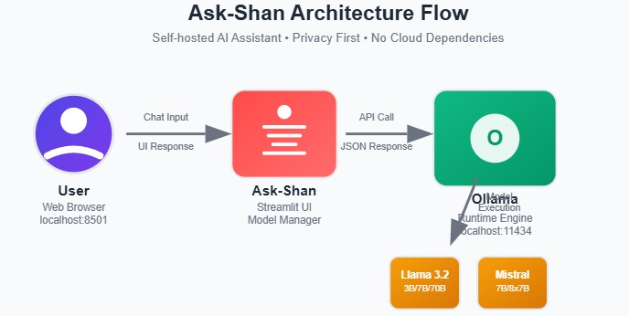
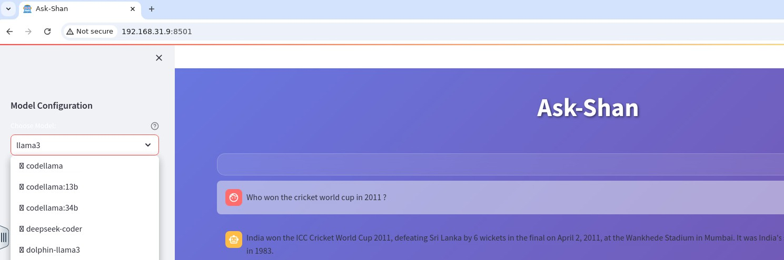
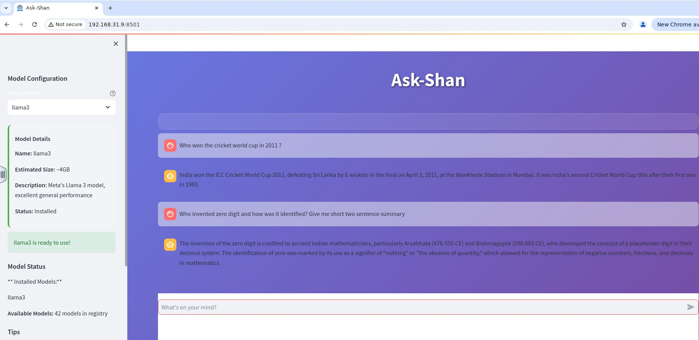

# Ask-Shan 

## **Your Gateway to Open, Public AI Models — Simple, Secure -->Your Machine -->Your Rules**

**Ask-Shan is a self-hosted, privacy-centric conversational AI assistant that delivers ChatGPT-like functionality locally on your desktop. It operates without any usage limits or reliance on cloud services, ensuring full control over your data and seamless, unrestricted access at all times. Ask-Shan is designed and built using Streamlit that provides a user-friendly interface for chatting with local AI models through Ollama.**

##  Features

- Multiple AI Models: Support for 30+ popular AI models from Ollama
- Auto-Download: Automatically download and install models with one click
- Model Management: View installed models vs available models
- Real-time Chat: Seamless conversation experience with AI models
- Responsive Design: Works great on desktop and mobile devices
- Docker Support: Easy deployment with Docker containerization



##  Supported Models

Ask-Shan supports a wide range of AI models including:



### General Purpose Models
- **Llama Series**: llama3.2, llama3.1, llama3, llama2 (various sizes)
- **Mistral**: mistral, mixtral (mixture of experts)
- **Phi**: phi3 (Microsoft's efficient models)
- **Gemma**: Google's open source models
- **Qwen**: Alibaba's multilingual models

### Specialized Models
- **Code Generation**: codellama, deepseek-coder
- **Mathematics**: wizard-math
- **Vision**: llava (Large Language and Vision Assistant)
- **Medical**: medllama2
- **Conversational**: vicuna, openchat, neural-chat

##  Installation & Setup

### Option 1: Docker Deployment (Recommended)

1. **Clone the repository**
   ```bash
   git clone <your-repo-url>
   cd ask-shan
   ```

2. **Build and run with Docker**
   ```bash
   docker build -t ask-shan .
   docker run -p 8501:8501 -p 11434:11434 ask-shan
   ```

3. **Access the application**
   - Open your browser and navigate to `http://localhost:8501`



### Option 2: Local Installation

1. **Prerequisites**
   - Python 3.11+
   - Ollama installed on your system

2. **Install Ollama**
   ```bash
   # On Linux/Mac
   curl -fsSL https://ollama.com/install.sh | sh
   
   # On Windows
   # Download from https://ollama.com/download
   ```

3. **Clone and setup**
   ```bash
   git clone <your-repo-url>
   cd ask-shan
   pip install -r requirements.txt
   ```

4. **Start Ollama server**
   ```bash
   ollama serve
   ```

5. **Run the application**
   ```bash
   streamlit run app.py
   ```

6. **Access the application**
   - Open your browser and navigate to `http://localhost:8501`


##  System Requirements

### Minimum
- **RAM**: 8GB (for small models)
- **Storage**: 10GB free space
- **CPU**: Multi-core processor
- **OS**: Linux, macOS, or Windows with Docker

### Recommended
- **RAM**: 16GB+ (for larger models)
- **Storage**: 50GB+ (for multiple models)
- **CPU**: 8+ cores
- **GPU**: Optional, but improves performance

### Python Dependencies
```
streamlit==1.28.0
ollama==0.1.7
requests==2.31.0
```

##  Usage

### Getting Started
1. **Launch the application** and ensure Ollama is running
2. **Select a model** from the sidebar dropdown
3. **Download model** if not already installed (first-time setup)
4. **Start chatting** with your AI assistant!

### Model Selection
-  **Green checkmark**: Model is installed and ready
-  **Download icon**: Model needs to be downloaded
- **Model info**: View size, description, and status in the sidebar

### Tips for Best Experience
- **Larger models** (13B, 70B) provide better responses but need more RAM
- **Smaller models** (3B, 7B) are faster and use less memory
- **Specialized models** work best for specific tasks (coding, math, etc.)
- Keep the **Ollama server running** in the background

##  Docker Configuration

### Dockerfile Features
- **Multi-stage build** for optimized image size
- **Automatic Ollama installation** and configuration
- **Health checks** to ensure services are running
- **Exposed ports**: 8501 (Streamlit) and 11434 (Ollama)

### Docker Commands
```bash
# Build the image
docker build -t ask-shan .

# Run with port mapping
docker run -p 8501:8501 -p 11434:11434 ask-shan

# Run with volume for persistent models
docker run -p 8501:8501 -p 11434:11434 -v ollama_models:/root/.ollama ask-shan
```

##  Configuration

### Environment Variables
You can customize the application using environment variables:

```bash
# Ollama server URL (default: http://localhost:11434)
OLLAMA_HOST=http://localhost:11434

# Streamlit configuration
STREAMLIT_SERVER_PORT=8501
STREAMLIT_SERVER_ADDRESS=0.0.0.0
```

### Custom CSS
The application includes custom CSS for the  design. You can modify the styles in the `app.py` file to customize the appearance.

##  Troubleshooting

### Common Issues

**Q: "Ollama server is not running" error**
- **Solution**: Make sure Ollama is installed and run `ollama serve` in terminal

**Q: Model download fails**
- **Solution**: Check internet connection and ensure sufficient disk space

**Q: Out of memory errors**
- **Solution**: Try smaller models (3B, 7B) or increase system RAM

**Q: Slow responses**
- **Solution**: Use GPU acceleration if available, or try smaller models

### Debug Mode
Run with debug information:
```bash
streamlit run app.py --server.runOnSave=true --logger.level=debug
```

##  Performance Tips

### Model Size vs Performance
- **2-3B models**: Fast, low memory, good for simple tasks
- **7-8B models**: Balanced performance and resource usage
- **13B+ models**: Best quality responses, higher resource requirements

### System Optimization
- **Close unnecessary applications** to free up RAM
- **Use SSD storage** for faster model loading
- **Enable GPU acceleration** in Ollama for better performance

##  Contributing

We welcome contributions! Here's how you can help:

1. **Fork the repository**
2. **Create a feature branch**: `git checkout -b feature-name`
3. **Make your changes** and test thoroughly
4. **Submit a pull request** with a clear description

### Development Setup
```bash
git clone <your-repo-url>
cd ask-shan
pip install -r requirements.txt
pip install -r requirements-dev.txt  # If you have dev dependencies
```

##  License

This project is licensed under the MIT License - see the [LICENSE](LICENSE) file for details.

##  Acknowledgments

- **[Ollama](https://ollama.com/)** for providing the excellent local AI model runtime
- **[Streamlit](https://streamlit.io/)** for the amazing web app framework
- **[Meta AI](https://ai.meta.com/)** and other organizations for open-source models

##  Support

- **Issues**: Report bugs or request features on GitHub Issues
- **Documentation**: Check the [Ollama documentation](https://github.com/ollama/ollama) for model-specific help

---

##  Author

**Rakshith Shanbhag**  

**Star ⭐ this repo if you find it useful!**
**Happy Chatting!** 
